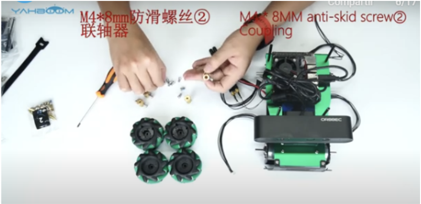
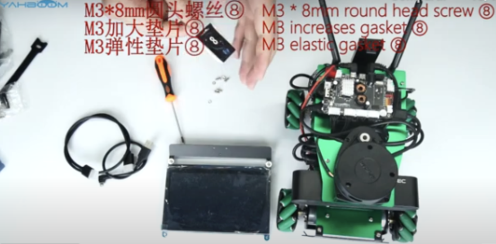
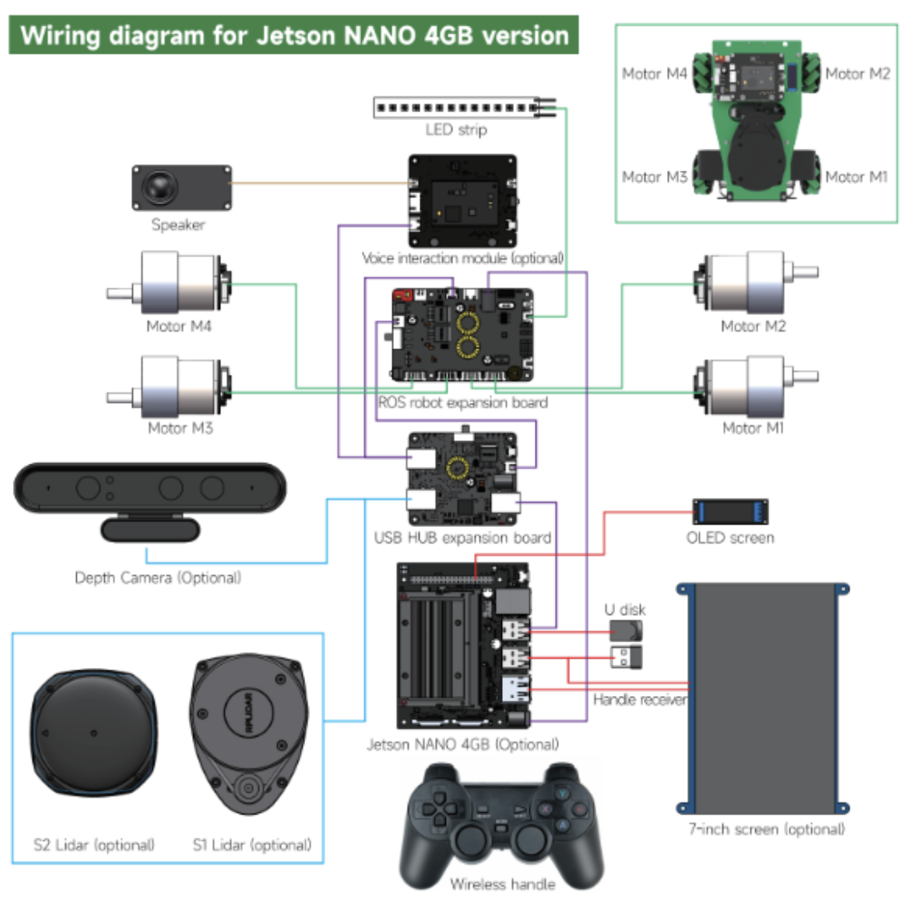
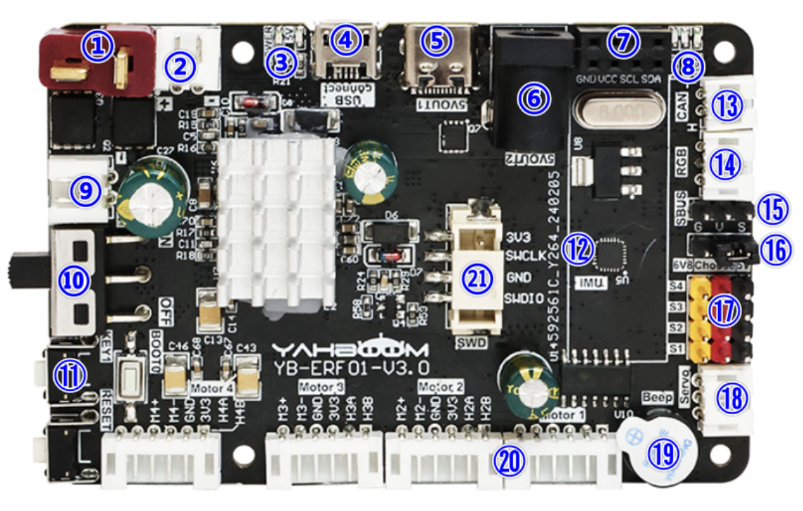
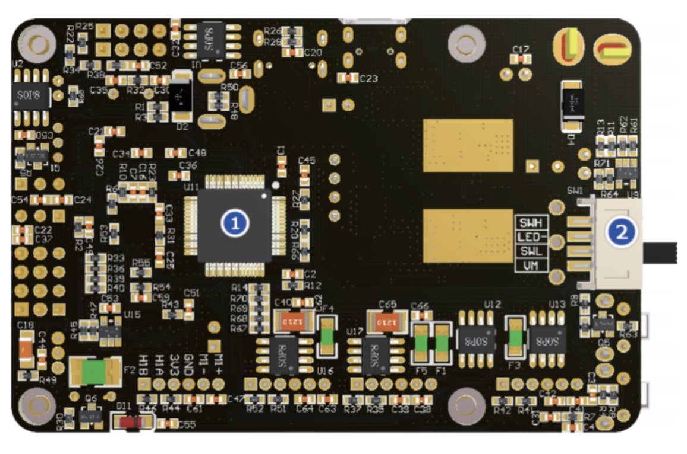
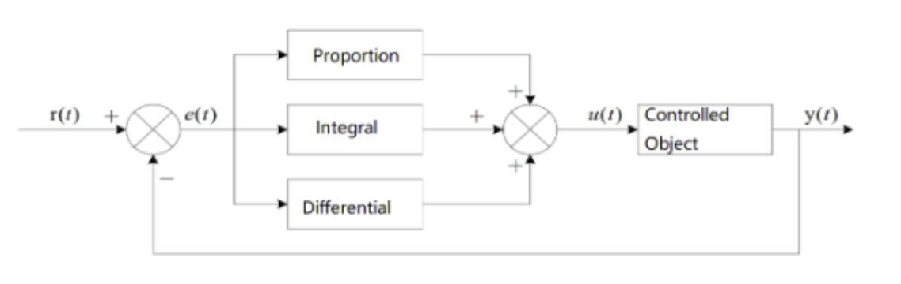
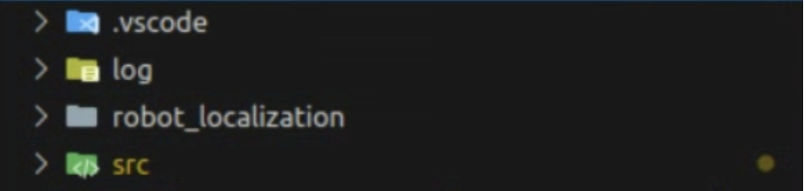
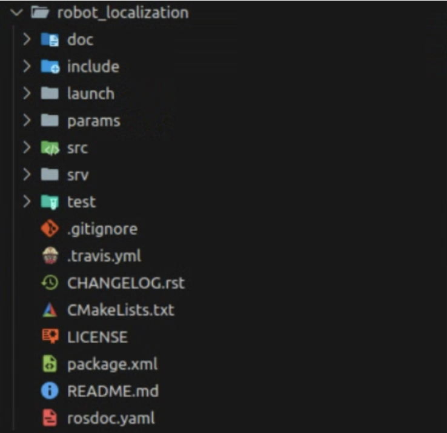
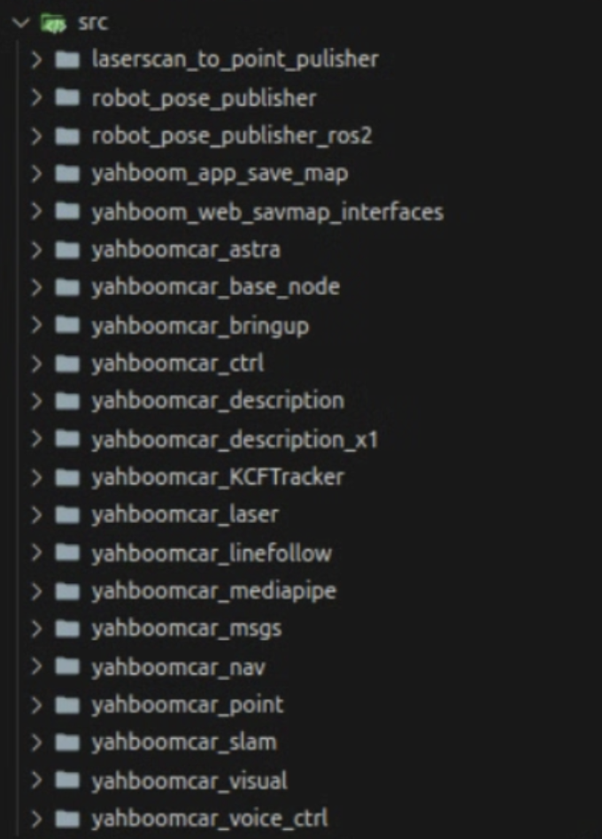

# x3_ws - ROSMASTER X3 Robot Workspace

## 1. Introducción

El ROSMASTER X3 es un robot educativo avanzado diseñado para facilitar el aprendizaje y desarrollo en sistemas robóticos basados en el sistema operativo ROS (Robot Operating System). Este robot es compatible con múltiples plataformas de control, incluyendo Jetson NANO, Jetson Orin NX, Jetson Orin Nano y Raspberry Pi 5, lo que lo convierte en una herramienta versátil para aplicaciones de inteligencia artificial y robótica autónoma.

---

## 2. Descripción del sistema mecánico

El robot tiene un sistema mecánico robusto y versátil, sus principales componentes son:

- **Chasis de aleación de aluminio suspendido**: La estructura del robot está fabricada en una aleación de aluminio de alta calidad, lo que le otorga resistencia y durabilidad. Este diseño suspendido mejora la estabilidad durante la operación, permitiendo al robot adaptarse a diferentes superficies y minimizar las vibraciones.

- **Ruedas Mecanum de 65 mm**: Equipado con cuatro ruedas Mecanum de 2.559 pulgadas (aproximadamente 65 mm), el ROSMASTER X3 es capaz de moverse en cualquier dirección sin necesidad de girar sobre su eje. Esta capacidad omnidireccional facilita maniobras complejas, como desplazamientos laterales y diagonales, esenciales en entornos reducidos o con obstáculos.

- **Soporte elevado para cámara de profundidad**: El diseño incluye un soporte elevado para la cámara de profundidad, lo que amplía el campo de visión y mejora la capacidad de reconocimiento del entorno. Esta característica es crucial para aplicaciones que requieren detección precisa de objetos y navegación autónoma.

- **Compatibilidad con brazo robótico de 6 grados de libertad**: puede integrarse con un brazo robótico de 6 GDL, ampliando sus capacidades para realizar tareas complejas como manipulación de objetos, ensamblaje y otras aplicaciones que requieren alta precisión y flexibilidad. ​

- **Pantalla táctil ajustable**: Incorpora una pantalla táctil de alta definición que puede ajustarse en ángulo, facilitando la interacción del usuario con el sistema y proporcionando una interfaz intuitiva para el control y monitoreo de las operaciones del robot.

---

## 3.Descripción del sistema electrónico

El sistema está compuesto por una Jetson Nano 4GB que actúa como la unidad central de procesamiento, encargada de ejecutar los algoritmos de control y procesamiento de datos. Esta Jetson está conectada a una unidad de disco, un USB HUB para ampliar sus puertos, una pantalla OLED y una pantalla principal de 7 pulgadas.

A través del USB HUB, la Jetson se comunica con dos LIDARs (S1 y S2), una cámara de profundidad opcional y un control inalámbrico. Toda la distribución de energía y la conexión con los actuadores la gestiona la ROS Robot Expansion Board, que recibe la alimentación desde una batería de 12V y la regula para suministrar energía tanto a la Jetson como a los periféricos. La placa de expansión también controla directamente cuatro motores DC, una tira de LEDs RGB y otros dispositivos como buzzers o servos.

Además, tiene un microcontrolador interno que recibe comandos de la Jetson Nano mediante USB para ejecutar las órdenes físicas, como mover los motores o encender las luces. Opcionalmente, el sistema puede incluir un módulo de interacción por voz para recibir comandos hablados. En conjunto, la Jetson Nano piensa y decide, mientras que la placa de expansión se encarga de ejecutar las acciones físicas, recibiendo energía y distribuyendo según la demanda de cada componente.

**Sobre la placa de expansión.**

La placa de expansión board_V3.0 actúa como puente entre la computadora principal (Jetson Nano o Raspberry Pi) y todos los periféricos del robot. Funciona como un "hub" que distribuye la energía y permite la comunicación con motores, servos, sensores y otros módulos.

**La estructura básica es la siguiente:**

- **Alimentación**: La placa recibe energía desde una batería de 12V y la distribuye de manera eficiente, bajando el voltaje a 5V para alimentar la Jetson Nano y otros componentes que lo requieran, y manteniendo los 12V para motores y dispositivos que necesitan más potencia.

- **Microcontrolador integrado**: Es un pequeño "cerebro" que ejecuta las órdenes que la Jetson Nano le envía por USB. Este microcontrolador es el encargado de mover motores, controlar servos, leer sensores y gestionar periféricos como luces y buzzer.

- **Interfaces de conexión**: La placa tiene diferentes conectores para facilitar la instalación de:

  - **Motores DC y servos** (controlados mediante PWM o señales seriales).
  - **Sensores I2C y sensores de actitud** (como el IMU que mide - - aceleración, giro y orientación).
  - **Sistemas de comunicación como CAN** (para redes de dispositivos industriales o automotrices) y SBUS (para receptores RC).

- **Control y monitoreo**: Incluye botones físicos para reiniciar o programar el microcontrolador, indicadores LED para saber si la placa está encendida o si está funcionando correctamente, y un buzzer para alertas sonoras.

- **Gestión de energía**: La placa no solo distribuye la corriente, sino que te permite elegir el voltaje para ciertos periféricos (por ejemplo, puedes elegir entre 5V y 6.8V para los servos) y cuenta con protecciones básicas para evitar problemas eléctricos.

**¿Cómo funciona en conjunto?**

La Jetson Nano es la que toma decisiones y planifica las acciones (por ejemplo, moverse hacia un punto o estabilizar el robot), mientras que la placa de expansión ejecuta esas órdenes enviando señales a los motores, servos y sensores. Es decir, la Jetson piensa, y la placa hace que el robot "mueva los músculos".

---

## 4. Descripción, diagrama de bloques y tablas referentes a la puertos e interfaces comunicación de elementos

El sistema general contiene los siguientes elementos electrónicos

| N.º | Componente                                                                         |
| --- | ---------------------------------------------------------------------------------- |
| 1   | Interfaz de entrada de alimentación en T de 12V CC                                 |
| 2   | Salida de alimentación de 12V CC                                                   |
| 3   | Luz indicadora de encendido                                                        |
| 4   | Interfaz Micro USB de datos (comunicación con el host y carga de programas)        |
| 5   | Interfaz tipo C (solo alimentación de 5.1V/5A para Raspberry Pi 5)                 |
| 6   | Salida de 5V CC (para alimentar la Jetson Nano)                                    |
| 7   | Interfaz I2C (para conectar dispositivos I2C externos, como pantallas OLED)        |
| 8   | Luz indicadora (de datos y de voltaje de 6.8V)                                     |
| 9   | Salida adicional de alimentación de 12V CC                                         |
| 10  | Interruptor principal de 12V                                                       |
| 11  | Botones: KEY1 (función personalizada), RESET (reinicio), BOOT0 (modo programación) |
| 12  | Sensor de actitud de nueve ejes (IMU)                                              |
| 13  | Interfaz CAN                                                                       |
| 14  | Interfaz para tira de luces RGB                                                    |
| 15  | Interfaz SBUS (para receptores de control remoto)                                  |
| 16  | Selector de voltaje para servos PWM (5V o 6.8V mediante jumper)                    |
| 17  | Interfaz para servos PWM                                                           |
| 18  | Interfaz para servos seriales (brazos robóticos)                                   |
| 19  | Zumbador (buzzer para alarmas)                                                     |
| 20  | Puerto para conexión de cuatro motores                                             |
| 21  | Interfaz de depuración SWD (para programadores ST-Link o J-Link)                   |

| N.º | Componente                                                               |
| --- | ------------------------------------------------------------------------ |
| 1   | Microcontrolador integrado (controla periféricos como buzzers y motores) |
| 2   | Interfaz de depuración (SWD para programadores ST-Link o J-Link)         |

**PID algorithm theory**

El control PID que implementaremos se basa en tres partes clave: proporcional (P), integral (I) y derivativa (D). La parte proporcional reacciona rápidamente a los errores presentes, la integral corrige errores acumulados a largo plazo para eliminar la desviación permanente, y la derivativa anticipa la tendencia del error para suavizar la respuesta y reducir el sobrepaso. Usaremos el algoritmo PID incremental, que calcula la variación de la señal de control en cada ciclo, mejorando la estabilidad y facilitando el manejo de errores imprevistos. Ajustaremos los parámetros KpK_pKp​, TiT_iTi​ y TdT_dTd​ mediante pruebas para lograr una respuesta rápida y estable.

---

## 5. Descripción de software, estructura de paquetes, descripción de librerías propietarias y de terceros necesarias, listado de programas de operación del robot y descripción de su propósito

El código fue construido para funcionar con ROS1 y ROS2, la descripción siguiente es con base a ROS2:
El repositorio en general a nivel raíz contiene los siguientes directorios:

El directorio log: contiene archivos de logs generados durante la ejecución.
El paquete de robot_localization contiene archivos necesarios para la localización precisa del robot a través de los datos que capturan los sensores:

La descripción de cada directorio son los siguientes:

- **include**: Archivos de cabecera para C++.
- **launch**: Archivos para lanzar rápidamente los nodos del paquete.
- **params**: Configuración o parámetros ajustables.
- **src**: Código fuente del paquete.
- **srv**: Definiciones de servicios ROS.
- **package.xml**: Información del paquete (nombre, versión, dependencias).

Regresando a la raíz del repositorio tenemos a src, el cual contiene los paquetes específicos relacionados al robot. Dentro de esta carpeta se encuentra:

- **laserscan_to_point_publisher**: Convierte datos láser a puntos 3D.
- **robot_pose_publisher** y **robot_pose_publisher_ros2**: Publican la posición actual del robot.
- **yahboom_app_save_map**: Guarda los mapas generados.
- **yahboomcar_astra**: Usa la cámara (imágenes y profundidad).

- **yahboomcar_base_node**: Controla los movimientos básicos del robot.
- **yahboomcar_bringup**: Lanza rápidamente todos los componentes necesarios del robot.
- **yahboomcar_ctrl**: Control más avanzado de movimientos específicos.
- **yahboomcar_description** y **yahboomcar_description_x1**: Archivos para simulación y visualización del robot.
- **yahboomcar_KCFTracker**: Rastrea objetos usando visión artificial.
- **yahboomcar_laser**: Maneja el sensor láser.
- **yahboomcar_linefollow**: Permite que el robot siga líneas.
- **yahboomcar_mediapipe**: Reconoce gestos o personas mediante cámara.
- **yahboomcar_msgs**: Mensajes personalizados para comunicación interna.
- **yahboomcar_nav**: Navegación automática usando mapas.
- **yahboomcar_slam**: Crea mapas y localiza al robot.
- **yahboomcar_visual**: Procesa imágenes para entender el entorno.
- **yahboomcar_voice_ctrl**: Control del robot con voz.

---

## 6. Procedimiento de encendido, operación y apagado del robot

**Encendido**:

1. **Conexión física:**
   a. Verificar que la batería se encuentre cargada.  
   b. Verificar que los sensores estén conectados.
2. **Encender robot:**  
   a. Activar el switch del robot.
3. **Conexión a la computadora:**  
   a. Conectar la computadora a la misma red del robot por WiFi o cable Ethernet o mediante conexión SSH.
4. **Iniciar entorno ROS2.**

**Operación**:

1. Control manual.
2. Creación de mapas.
3. Navegación autónoma.
4. Control por voz o gestos.

**Apagado**:

1. Acabar con las terminales con `Ctrl + C`.
2. Apagar ROS2.
3. **Apagado físico del robot:**  
   a. Desactivar el switch del robot.

---

## 7. Restricciones de software, hardware y mecánicas

**Restricciones de software**

El sistema depende del uso de ROS2 Humble Hawksbill, que es compatible únicamente con Ubuntu 22.04 o versiones específicas de Debian. No es compatible con otros sistemas operativos fuera del ecosistema ROS.

Algunas funciones avanzadas requieren de contenedores Docker optimizados para Raspberry Pi 5 o sistemas con arquitecturas ARM.

Se requiere tener conocimientos previos de Python y C++, dado que muchas de las librerías y scripts proporcionados por el fabricante no incluyen interfaces gráficas amigables.

Dependencia de librerías de terceros como OpenCV, Navigation2 y DepthAI, las cuales deben mantenerse actualizadas para evitar conflictos de versiones.

**Restricciones de hardware**

El robot está optimizado para funcionar con Raspberry Pi 5, limitando la posibilidad de usar computadoras embarcadas más potentes sin modificaciones físicas en el chasis.

Los motores y controladores de motores tienen un límite de carga útil. Transportar cargas pesadas o no previstas podría dañar el sistema de tracción.

La batería de litio suministrada posee un tiempo limitado de autonomía que varía entre 1.5 a 2 horas bajo condiciones normales de uso, restringiendo su operación continua en entornos de trabajo extensos.

**Restricciones mecánicas**

El chasis está diseñado para operar sobre superficies planas y lisas. Su estructura no está optimizada para terrenos irregulares o exteriores con obstáculos significativos.

Los sensores LiDAR y la cámara de profundidad están montados a una altura y ángulo fijo, limitando la capacidad de detectar obstáculos en ciertos rangos bajos o muy altos.

La maniobrabilidad está restringida a las capacidades del sistema diferencial de tracción, lo que limita la ejecución de giros extremadamente cerrados o el movimiento omnidireccional.

---

## 8. Resumen y conclusiones

El ROSMASTER X3 de Yahboom es una plataforma de robótica educativa y de desarrollo que integra un sistema mecánico robusto y modular con un entorno de programación basado en ROS2. Su arquitectura está especialmente diseñada para facilitar el aprendizaje de tecnologías avanzadas como visión por computadora, navegación autónoma, control por voz y aplicaciones de multi-robot.

El sistema mecánico destaca por un chasis compacto de aluminio, tracción diferencial y una variedad de sensores (LiDAR, cámara de profundidad, IMU, entre otros) que lo convierten en una herramienta versátil para simulaciones y pruebas reales de algoritmos de robótica.

En términos electrónicos, el robot integra una Raspberry Pi 5, controladores de motores de precisión y múltiples interfaces de comunicación (I2C, UART, USB y Ethernet), permitiendo una interconexión fluida entre sus diversos módulos.

El ecosistema de software, soportado sobre Ubuntu 22.04 + ROS2 Humble, provee una amplia compatibilidad con paquetes y librerías tanto propietarias como de terceros, potenciando la capacidad del robot para ser empleado en proyectos de investigación, educación y desarrollo de software embebido.

No obstante, el ROSMASTER X3 presenta limitaciones importantes relacionadas con la capacidad de carga, la duración de la batería y las restricciones asociadas al terreno donde se opera. También es relevante considerar la necesidad de conocimientos previos en programación y manejo de ROS para aprovechar completamente su potencial.

En conclusión, este robot para nosotros se presenta como una opción altamente didáctica y flexible para estudiantes y desarrolladores interesados en el campo de la robótica móvil, la inteligencia artificial aplicada y la automatización.
